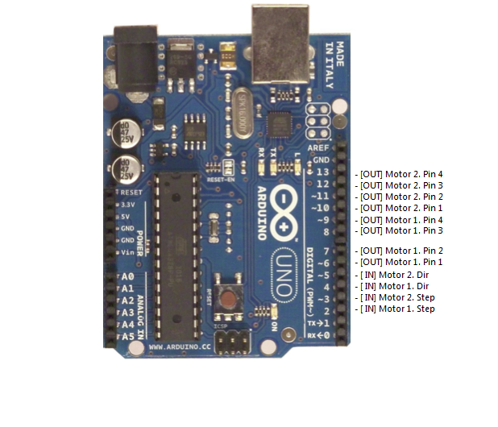

# SoftwareStepDirUnipolarDriver [](https://travis-ci.org/latonita/SoftwareStepDirUnipolarDriver
Arduino-based step/dir driver for unipolar motors connected via ULN2003 or similar circuits.

Only 2 axis supported at the moment.
  
I don't have special motor drivers (it is still travelling via china post), only my own DIY ULN2003 based. To use my motors with "standart" cnc controllers.
I decided to make step/dir driver out of spare Arduino and put it in-between controller (another Arduino with GRBL) and my ULN2003 motor driver.

This step/dir driver written in 30 mins, there was no intention to make optimized code.

Motors shut down after 2000 ms of inactivity.

Wiring:
```
 |----------------|          |------------ | -- coil 1 ->  |-------------| -> Unipolar
 | CNC Controller | --step-> | This driver | -- coil 2 ->  | ULN2003/2803| -> motor 
 | (GRBL or any)  | --dir -> | @Arduino Uno| -- coil 3 ->  | or other    | -> coils
 |----------------|          |-------------| -- coil 4 ->  |-------------| ->  
```
Input: 
- step and dir signals x2

Output: 
- 4 motor coil control pins x2

Pinout:

  


TODO: 
- motor enable pin (make it simple, one pin for all motors)
- pwm to hold motors in plase instead of shutdown (PWM for common VCC pin)
- microstepping with full PWM for coils. Only via software PWM since there is not enough pins

Author: Anton Viktorov, latonita@yandex.ru


